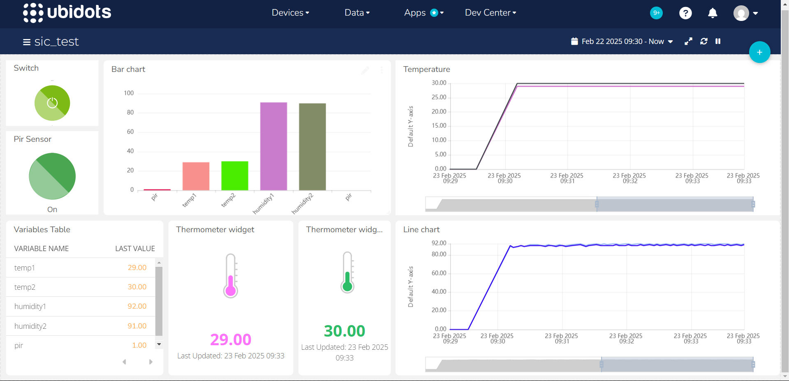

# Naks Jenderal

## Assignment Stage 2

This project is an implementation of an IoT system that utilizes the ESP32 as the main microcontroller to read data from two DHT sensors (temperature and humidity) and one PIR sensor (motion). The data collected from these sensors is sent directly to the Ubidots platform for real-time monitoring. Additionally, the data is stored in a MongoDB Atlas database using a Flask server built with Python. The Flask server acts as an intermediary between the ESP32 and MongoDB, where the data received from the ESP32 is processed and stored in the database. This project is designed to facilitate real-time environmental monitoring and the storage of historical data for further analysis.

### Sysyem Design

 
 
 

### Result of Project
 

#### Monitoring data using Ubidots

 

 

#### Store data to Atlas MongoDb

 

#### Prototype

